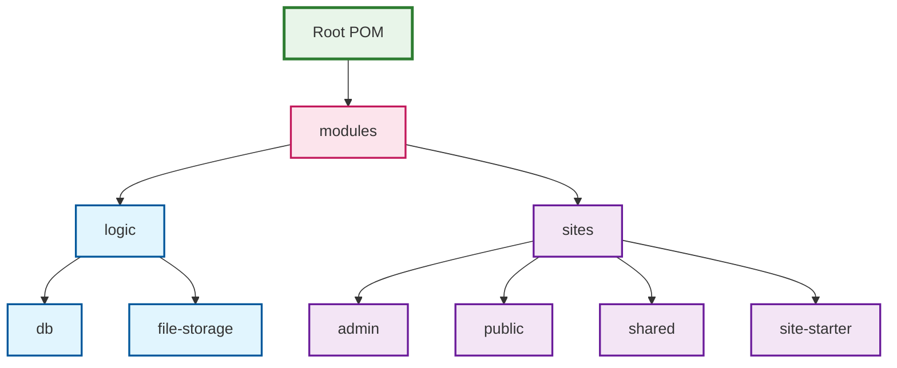

# Module Structure

## Overview
This project uses a modular architecture to separate concerns, promote code reuse, and facilitate AI-assisted development. The module structure is designed to clearly define boundaries between different parts of the system and establish explicit dependencies.

## Module Hierarchy

## Description of Modules

### Root Modules
The application is divided into two primary modules under the main modules directory:

### Logic Module
The Logic module contains the core business logic and domain model of the application. It is independent of any specific UI or delivery mechanism and defines the fundamental operations and entities of the system.

### Sites Module
The Sites module provides web interfaces and REST APIs for interacting with the system. It implements the delivery mechanisms and user interfaces.

## Module Responsibilities

### Logic Module
- Defines domain models and business entities
- Implements business rules and validation
- Provides service interfaces for business operations
- Independent of infrastructure concerns

### Logic/DB Module
- Handles database connections and transactions
- Provides repository implementations
- Maps between domain models and database entities
- Implements database-specific queries and operations

### Logic/File-Storage Module
- Manages file storage and retrieval
- Implements different storage strategies (local, cloud)
- Handles file metadata and organization
- Provides unified interfaces for file operations

### Sites Module
- Common configuration for all sites
- Shared dependency management for web components
- Base web server setup and configuration

### Sites/Admin Module
- Provides administrative interfaces
- Implements management screens
- Handles administrative operations
- Access control for admin users

### Sites/Public Module
- Implements public-facing web interfaces
- Handles user registration and login
- Presents content to end users
- Optimized for public consumption

### Sites/Shared Module
- Common UI components used across sites
- Shared templates and layouts
- Common JavaScript utilities
- Shared authentication components

### Sites/Site-Starter Module
- Determines which site to run based on configuration
- Initializes the appropriate site
- Handles startup and shutdown procedures
- Configures server parameters

## Module Design Principles

1. **Single Responsibility**: Each module has one clear purpose and set of related functionality
2. **Explicit Dependencies**: Dependencies between modules are explicitly declared in build files
3. **Interface Separation**: Modules expose their functionality through well-defined interfaces
4. **No Circular Dependencies**: The module hierarchy prevents circular dependencies
5. **Testability**: Each module can be tested in isolation with appropriate mocks for dependencies

## Creating New Modules

When creating new modules, follow these guidelines:

1. Place the module in the appropriate part of the hierarchy
2. Create a README.md that clearly states the module's purpose
3. Define interfaces before implementations
4. Follow the dependency rules of the architecture
5. Keep modules focused on a single responsibility
6. Document the public API thoroughly
7. Create comprehensive tests for the module

## AI Assistance for Modules

When using AI assistants for module development:

1. Direct the AI to focus on one module at a time
2. Reference the module's README.md to provide context
3. Emphasize interface contracts and validation requirements
4. Ask the AI to respect module boundaries and dependencies
5. Review generated code to ensure it follows module standards
